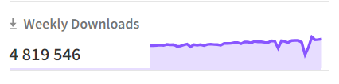

## Чтобы начать читать файлы, надо его импортировать пакет

//импортируем пакет fs
const fs = require('fs') - этот пакет уже встроен в node

Чтобы посмотреть доку, можно зайти на сайт node.js - там все стандартные пакеты можно найти. Например зайти в файлсистем. Пакетов много, все знать необзательно, но надо понимать что вообщ етам есть. Они встроенны в ноду и их не надо устанавливать.

Если что-то надо дополнительно, то можно зайти на npmjs.com
Их там дофига, поэтому можно найти что угодно. Нпм - это среда, где разрабы, которые заливают готовые решения.

## Как избежать ошибок с прописанием путей
const text = fs.readFileSync(`${__dirname}/contacts.txt`, 'utf-8') //прописываем путь и кодировку чтения

//если добавить __dirname +  - это глобальная переменная, которая хранит директорию, в которой находится текущий скрипт. Это позволяет не следить за тем, в какой папке я сейчас фактически нахожусь
//__dirname - это переменная, которая уже существует

## Установка пакета npm
Чтобы выбрать нормальный пакет npm, смотрим на количесество скачиваний, если там мало, то скоро загнется. Лучше брать те, которые за неделю скачиваются не менее 10тыс раз.
https://www.npmjs.com/package/libphonenumber-js - вот тут например почти 5 лямов 
Устанавливаем пакет по доке в npm (npm i libphonenumber-js) - в json запишется зависимость

## Как делить файлы на модули (Common JS)
Зачем это нужно? -разделить структурно код, чтобы избежать ошибки и было меньше строк кода в одном файле. Много кода - плохо читается и сложно редачить / понимать. Поэтому делится на файлы. 

Все файлы в js друг от друга изолированы, поэтому если хотим воспользоваться чем-либо (например функцией из другого файла), то нам нужно сделать импорт / экспорт

Это пишем в файле дополнительном, например где наши функции лежат
module.exports = {
  showAll,
  addNumber,
};

Это пишем в файле основном, в котором делаем вызов
const { showAll, addNumber} = require('./library')
