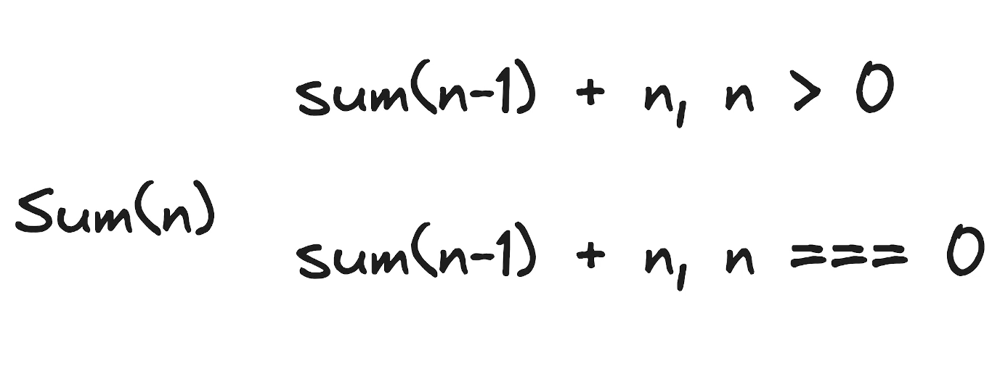

## Recursion

Допустим задача
Sum(5) = 0 + 1 + 2 + 3 + 4 + 5
Ее можно решить через for / reduce  ... но проще через рекусию.

В рекурентных соотношениях всегда есть несколько случаев

Рекурентное соотношение

оба случая должны обязательно быть

Пример задачи для подсчета размера содержимого папок

## Более подробно про рекурсию - https://doka.guide/js/recursion/