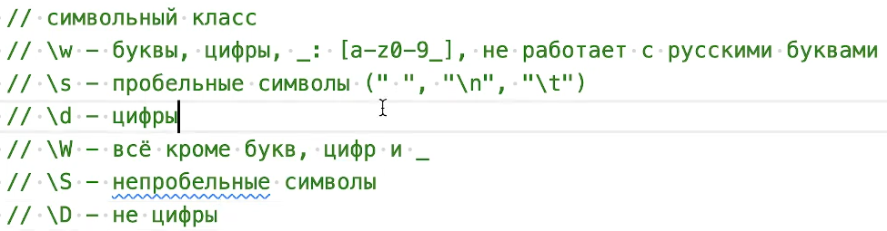
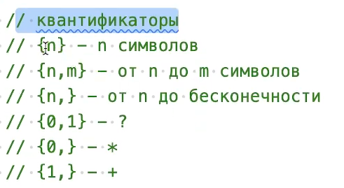

## Строки
Это примитивный тип данных. Представляет собой последовательность символов в кавычках.
* "Это строка"
* 'И это строка'

#### Специальные символы и экранирование
* 'Можно переносить\nна новую строку'
* 'Использовать \'кавычки\''
* 'Шестнадцатеричные ASCII коды: \x20'
* 'Unicode-символы: \u2014' // номер Unicode-символа в hex

#### Шаблонные литералы
Создаются через обратные кавычки (backticks).
В шаблонные строки можно вставлять JS-выражения.
```c
const names = ['Олег', 'Анна', 'Майк'];


names.forEach((name) => {
	console.log(`Привет, ${name}`); // ← шаблонный литерал
});
```
Это также называется “интерполяция строк”.

#### Индексы строки
Получение символа по индексу:
```c
const str = 'Cтрока';
str[1]; // "т"
str.charAt(1); // "т"
str​.​charCodeAt​(​1); // 1090 - десятичный номер символа Юникода
```

## Регулярные выражения
Это выражения написанные в косых слешах / /. Это выражение позволяет нам что-то находить внутри строки.
Метод test он позволяет понять соответствует ли строка регулярному выражению.
Для удобства лучше поставить и включить расширение https://marketplace.visualstudio.com/items?itemName=WallabyJs.quokka-vscode - в режиме реального времени показывает что возвращает console.log. Расширение надо включать на каждый файл, автоматом он не подключается.

Наборы символов:

|                   |                     |
|:-----------------:|:------------------: |
| \d — [0-9]        | \D — [^0-9]         |
| \w — [a-zA-Z0-9_] | \W — [^a-zA-Z0-9_]  |
| \s — [\t\n\v\f\r ]| \S — [^\t\n\v\f\r ] |
  . (точка) — любой символ


  Синтаксис регулярных выражений использует специальные символы:
[ ] \ ^ $ . | ? * + ( ) { }
Если нужно найти эти символы как обычный текст, их надо экранировать через \\.

 . 		специальный символ — совпадает с любым текстовым символом

\\.		обычный символ — совпадает только с текстовой точкой


#### Повторения
* {n} — ровно n вхождений
* \d{3} — срабатывает на 3 цифры подряд — то же самое, что и \d\d\d
* {2,4} — от 2 до 4 вхождений
* {3,} — 3 и более вхождения



Генератор регулярных выражений -  https://regex101.com/

